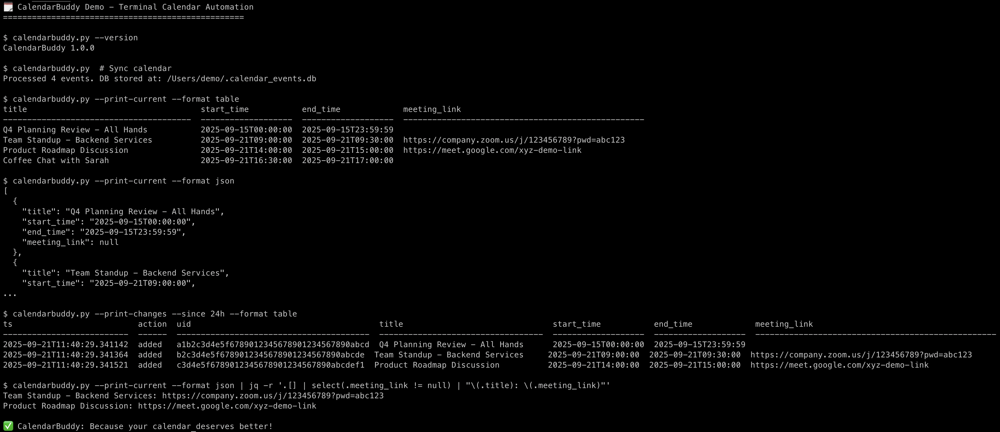

# CalendarBuddy

A macOS calendar synchronization tool that bridges your Calendar app with SQLite, enabling automated tracking, querying, and analysis of your events with full change history.

## 🎬 Demo



*See CalendarBuddy in action: sync calendar, view events, track changes, and extract meeting links - all from the terminal.*

## What It Does

CalendarBuddy automatically syncs your macOS Calendar events to a local SQLite database, providing:
- **Real-time sync** with your calendar events
- **Complete change history** - never lose track of when meetings were scheduled, moved, or cancelled
- **Smart meeting link extraction** from event details (Zoom, Google Meet, Teams, etc.)
- **Flexible querying** with date ranges and multiple output formats
- **Automated scheduling** via cron for hands-free operation
- **No API approvals needed** - bypasses corporate restrictions on calendar APIs and third-party integrations
- **Terminal-native workflow** - perfect for developers who live in the command line

## Why CalendarBuddy?

### 🚫 Corporate Restrictions? No Problem!
Many organizations restrict:
- **Calendar API access** - requires security approval that rarely gets approved
- **Third-party Slack apps** - blocked by IT security policies  
- **External integrations** - compliance and data protection concerns

**CalendarBuddy's solution:** Since most companies allow macOS devices that sync with Google Calendar/Exchange, CalendarBuddy works entirely through your local macOS Calendar app using `icalBuddy`. No APIs, no approvals, no external connections - just local automation that works.

### 💻 Built for Terminal Lovers
If you're a developer who prefers the command line:
- **Everything in terminal** - no GUI required
- **Scriptable and pipeable** - integrate with your existing workflows
- **Multiple output formats** - JSON, CSV, or human-readable tables
- **Cron-friendly** - set it and forget it automation
- **Local SQLite storage** - query with standard SQL tools

## Installation

### Prerequisites
- macOS with Calendar app
- Python 3.6+
- [icalBuddy](https://hasseg.org/icalBuddy/) installed

### Quick Install
```bash
# Clone the repository
git clone https://github.com/psujit775/CalendarBuddy.git
cd CalendarBuddy

# Run the automated setup
chmod +x setup.sh
./setup.sh
```

### Manual Install
```bash
# Install icalBuddy via Homebrew
brew install ical-buddy

# Download and setup CalendarBuddy
curl -O https://raw.githubusercontent.com/psujit775/CalendarBuddy/main/calendarbuddy.py
chmod +x calendarbuddy.py
mv calendarbuddy.py ~/calendarbuddy.py

# Test installation
~/calendarbuddy.py --version
```

## Quick Start

```bash
# Initial sync with historical data (recommended first run)
~/calendarbuddy.py --lookback 30

# Daily sync (run this regularly via cron)
~/calendarbuddy.py

# View today's events
~/calendarbuddy.py --view

# View events for a specific date
~/calendarbuddy.py --view --date 2025-10-15

# View recent changes
~/calendarbuddy.py --print-changes --since 24h
```

## Use Cases & Examples

### 🔄 Automated Calendar Sync
Set up automatic syncing with optimal performance:
```bash
# Primary sync: every 30 minutes (default lookback 0 = today only, fast)
*/30 * * * * /usr/bin/python3 /path/to/calendarbuddy.py >> /tmp/calendar-sync.log 2>&1

# Weekly maintenance: catch retroactive changes (Sundays at 6 AM)
0 6 * * 0 /usr/bin/python3 /path/to/calendarbuddy.py --lookback 7 >> /tmp/calendar-sync.log 2>&1

# Optional: monthly deep sync for thoroughness (1st of month at 2 AM)
0 2 1 * * /usr/bin/python3 /path/to/calendarbuddy.py --lookback 30 >> /tmp/calendar-sync.log 2>&1
```

**Why this setup:** The default behavior (lookback 0) is optimized for frequent syncing - it's fast and efficient. Weekly lookback catches retroactive changes without impacting daily performance.

### 📊 Meeting Analytics & Reports
```bash
# Export this month's meetings to analyze patterns
~/calendarbuddy.py --view --from 2025-09-01 --to 2025-09-30 --format csv > september_meetings.csv

# Track meeting frequency by extracting meeting links
~/calendarbuddy.py --view --format json | jq '.[] | select(.meeting_link != null)'
```

**Use case:** consultants billing clients, or personal productivity analysis.

### 🕵️ Change Auditing & Accountability
```bash
# See what changed in the last week
~/calendarbuddy.py --print-changes --since 168h --format table

# Track specific meeting modifications
~/calendarbuddy.py --print-changes --format json | jq '.[] | select(.action == "updated-old-marked-deleted")'
```

**Use case:** project timeline forensics, or catching when important meetings get mysteriously cancelled.

### 🤖 Bypassing Corporate IT Restrictions

#### No Calendar API Required
```bash
# Traditional approach (often blocked):
# - Request Google Calendar API access → Security review → Denied
# - Install third-party Slack app → IT approval → Rejected

# CalendarBuddy approach (works everywhere):
~/calendarbuddy.py --view --format json | jq '.[]'
# Uses local macOS Calendar (already approved) + local processing only
```

#### Silent Automation for Restricted Environments
```bash
# Morning briefing (no external APIs)
~/calendarbuddy.py --view --date $(date +%Y-%m-%d) --format table

# Export for compliance reporting (stays local)
~/calendarbuddy.py --view --from 2025-09-01 --to 2025-09-30 --format csv > monthly_meetings.csv
```

### 🤖 Integration with Other Tools

#### Slack Integration
```bash
#!/bin/bash
# notify-next-meeting.sh
NEXT_MEETING=$(~/calendarbuddy.py --view --date $(date +%Y-%m-%d) --format json | jq -r '.[0] | "\(.title) at \(.start_time)"')
curl -X POST -H 'Content-type: application/json' \
  --data "{\"text\":\"Next meeting: $NEXT_MEETING\"}" \
  YOUR_SLACK_WEBHOOK_URL
```

### 📱 Personal Productivity

#### Daily Standup Prep
```bash
#!/bin/bash
# daily-prep.sh
echo "=== TODAY'S SCHEDULE ==="
~/calendarbuddy.py --view --date $(date +%Y-%m-%d) --format table

echo -e "\n=== RECENT CHANGES ==="
~/calendarbuddy.py --print-changes --since 24h --format table

echo -e "\n=== TOMORROW'S PREP ==="
~/calendarbuddy.py --view --date $(date -j -v+1d +%Y-%m-%d) --format table
```

#### Weekly Review
```bash
# Generate weekly meeting summary
~/calendarbuddy.py --view \
  --from $(date -j -v-7d +%Y-%m-%d) \
  --to $(date +%Y-%m-%d) \
  --format csv > this_week_meetings.csv
```

### 💻 Terminal-Native Workflows

#### Command Line Calendar Dashboard
```bash
# One-liner daily brief
~/calendarbuddy.py --view --date $(date +%Y-%m-%d) --format table && echo "---" && ~/calendarbuddy.py --print-changes --since 24h --format table
```

#### Pipe-Friendly Data Processing
```bash
# Count meetings per day this week
~/calendarbuddy.py --view --from $(date -j -v-mon +%Y-%m-%d) --to $(date -j -v+sun +%Y-%m-%d) --format csv | \
  tail -n +2 | cut -d',' -f2 | cut -d'T' -f1 | sort | uniq -c

# Show event title + meeting link for easier identification
~/calendarbuddy.py --view --format json | jq -r '.[] | select(.meeting_link != null) | "\(.title): \(.meeting_link)"'
```

#### Terminal Aliases for Daily Use
```bash
# Add to your .bashrc/.zshrc
alias today="calendarbuddy.py --view --date "$(date +%Y-%m-%d)" --format table"
alias tomorrow="calendarbuddy.py --view --date "$(date -j -v+1d +%Y-%m-%d)" --format table"
```

## Command Reference

### Basic Operations
```bash
# Sync calendar (default: today only, lookback 0)
calendarbuddy.py

# Sync with lookback period (sync last 7 days)
calendarbuddy.py --lookback 7

# Sync with 30-day lookback (great for initial setup)
calendarbuddy.py --lookback 30

# Dry run (test without writing to database)
calendarbuddy.py --dry-run --lookback 7
```

### Lookback Period Configuration
```bash
# Default behavior (lookback 0 = today only)
calendarbuddy.py                    # Syncs today's events only

# Historical sync options
calendarbuddy.py --lookback 1       # Yesterday + today
calendarbuddy.py --lookback 7       # Last 7 days (recommended for weekly maintenance)
calendarbuddy.py --lookback 30      # Last 30 days (good for initial setup)

# Test before running
calendarbuddy.py --dry-run --lookback 14
```

### Viewing Events
```bash
# Today's events (default)
calendarbuddy.py --view

# Specific date
calendarbuddy.py --view --date 2025-12-25

# Date range
calendarbuddy.py --view --from 2025-10-01 --to 2025-10-31

# All events in database
calendarbuddy.py --view --from 1900-01-01 --to 2100-01-01
```

### Sync Operations
```bash
# Basic sync (default: lookback 0, today only)
calendarbuddy.py

# Sync with historical data
calendarbuddy.py --lookback 7       # Last 7 days
calendarbuddy.py --lookback 30      # Last 30 days

# Test sync without writing to database
calendarbuddy.py --dry-run --lookback 14
```

### Viewing Change History
```bash
# All changes
calendarbuddy.py --print-changes

# Last 6 hours
calendarbuddy.py --print-changes --since 6h

# Since specific timestamp
calendarbuddy.py --print-changes --since 2025-09-20T10:00:00
```

### Output Formats
```bash
# Table format (default, human-readable)
calendarbuddy.py --view --format table

# JSON (for scripting/APIs)
calendarbuddy.py --view --format json

# CSV (for spreadsheets/analysis)
calendarbuddy.py --view --format csv
```

## Data Storage

### Database Location
- **File:** `~/.calendar_events.db` (SQLite)
- **Backup recommended:** This contains your complete calendar history

### Database Schema
```sql
-- Active/historical events
CREATE TABLE events (
    uid TEXT PRIMARY KEY,           -- SHA1 hash of title+start+end
    title TEXT,                     -- Event title
    start_time TEXT,               -- ISO datetime (YYYY-MM-DDTHH:MM:SS)
    end_time TEXT,                 -- ISO datetime
    first_seen TEXT,               -- When first detected
    last_seen TEXT,                -- Last sync timestamp
    meeting_link TEXT,             -- Extracted meeting URL
    deleted INTEGER DEFAULT 0      -- 0=active, 1=removed
);

-- Complete audit trail
CREATE TABLE changes (
    id INTEGER PRIMARY KEY,
    ts TEXT,                       -- Change timestamp
    action TEXT,                   -- added/removed/updated-old-marked-deleted
    uid TEXT,                      -- Event UID
    title TEXT,                    -- Event details...
    start_time TEXT,
    end_time TEXT,
    meeting_link TEXT
);
```

## Configuration & Best Practices

### Default Settings
CalendarBuddy uses these defaults out of the box:
- **Lookback period:** 0 days (today only)
- **Output format:** table (human-readable)
- **Database location:** `~/.calendar_events.db`
- **Sync behavior:** Fetch and update database

### Recommended Setup

**1. Initial Setup (one-time):**
```bash
# Populate database with historical events
~/calendarbuddy.py --lookback 30
```

**2. Daily Automation (cron):**
```bash
# Add to crontab (crontab -e) - sync every 30 minutes
*/30 * * * * /usr/bin/python3 /Users/username/calendarbuddy.py >> /tmp/calendar-sync.log 2>&1
```

**3. Weekly Maintenance (optional but recommended):**
```bash
# Add to crontab - catch retroactive changes every Sunday at 6 AM
0 6 * * 0 /usr/bin/python3 /Users/username/calendarbuddy.py --lookback 7 >> /tmp/calendar-sync.log 2>&1
```

### Lookback Period for Historical Sync

The `--lookback` option allows you to sync events from previous days, which is essential for:

**Initial Setup:**
```bash
# Sync last 30 days when first setting up
~/calendarbuddy.py --lookback 30
```

**Catching Retroactive Changes:**
```bash
# Weekly sync with 7-day lookback to catch late additions/modifications
~/calendarbuddy.py --lookback 7
```

**Default Behavior:**
- **Default lookback:** 0 days (today only)
- **Recommended for cron:** Keep default (0) for daily automation
- **Weekly maintenance:** Use `--lookback 7` to catch retroactive changes
- **Initial setup:** Use `--lookback 30` to populate historical data

**Use Cases:**
- **Initial database population:** Get your historical events
- **Retroactive event additions:** Catch events added to past dates  
- **Meeting modifications:** Detect changes to historical meetings
- **Vacation catch-up:** Sync events that were added while you were away

**Performance Notes:**
- Larger lookback periods take longer to process
- icalBuddy may timeout on very large date ranges (30+ days)
- Consider breaking large syncs into smaller chunks if needed

**Recommended Configuration:**
```bash
# Daily cron job (fast, efficient)
*/30 * * * * /usr/bin/python3 /Users/username/calendarbuddy.py

# Weekly maintenance (catch retroactive changes)
0 6 * * 0 /usr/bin/python3 /Users/username/calendarbuddy.py --lookback 7

# Monthly deep sync (optional, for thoroughness)
0 2 1 * * /usr/bin/python3 /Users/username/calendarbuddy.py --lookback 30
```

### Custom Meeting Domains
Edit the script to prioritize your organization's meeting platforms:
```python
MEETING_DOMAINS_PRIORITY = [
    "your-company.zoom.us",
    "meet.google.com",
    "zoom.us",
    # ... rest of defaults
]
```

### Database Backup
```bash
# Create backup
cp ~/.calendar_events.db ~/.calendar_events.db.backup

# Restore from backup
cp ~/.calendar_events.db.backup ~/.calendar_events.db
```

## Troubleshooting

### Common Issues

**"icalBuddy not found"**
```bash
# Install icalBuddy
brew install ical-buddy

# Or check PATH
which icalBuddy
```

**"No events found"**
- Check Calendar app permissions
- Verify events exist: `icalBuddy eventsToday`

**Database locked errors**
```bash
# Check for other processes
lsof ~/.calendar_events.db

# Reset if needed (loses history)
rm ~/.calendar_events.db
```

### Debug Mode
```bash
# Show raw database contents
calendarbuddy.py --show-db

# Test parsing without writing
calendarbuddy.py --dry-run
```

## Privacy & Security

- **Local storage only:** All data stays on your machine
- **No external APIs:** Works entirely through macOS Calendar app
- **No network access:** Except for your existing calendar sync (Google/Exchange)
- **SQLite database:** Standard, inspectable format
- **Meeting links:** Extracted but not transmitted anywhere
- **Corporate-friendly:** No third-party app approvals needed
- **Compliance-ready:** All processing happens locally

## Contributing

We welcome contributions! Please see [CONTRIBUTING.md](CONTRIBUTING.md) for guidelines.

**Ideas for contributions:**
- Time zone support for global teams
- Calendar-specific filtering (work vs personal)
- GUI interface for non-terminal users  
- Additional export formats (iCal, Google Sheets)
- Integration examples for restricted environments

## License

GNU General Public License v3.0 - see [LICENSE](LICENSE) file for details.

This program is free software: you can redistribute it and/or modify it under the terms of the GNU General Public License as published by the Free Software Foundation, either version 3 of the License, or (at your option) any later version.

---

*CalendarBuddy: Because your calendar deserves better than being trapped in an app.*

**Perfect for:**
- 🏢 Corporate environments with strict API restrictions
- 💻 Terminal enthusiasts who automate everything  
- 🔒 Security-conscious teams who need local-only processing
- 📊 Data analysts who want SQL access to calendar data
- ⚡ Developers who prefer command-line workflows over GUI apps
